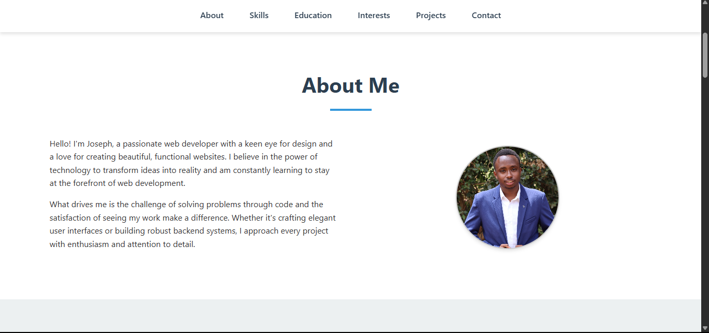

# Joseph Muthui's Portfolio Website

A responsive, visually appealing personal portfolio website built with pure HTML and CSS. This website showcases my skills, education, interests, and projects in a clean, professional layout.

## Features

- Fully responsive design that works on all devices
- Clean, modern UI with thoughtful typography and spacing
- Six main sections: About, Skills, Education, Interests, Projects, and Contact
- Interactive elements with smooth hover effects
- Downloadable CV/resume
- Project showcase with links to live demos and GitHub repositories
- Contact form (frontend only)

## Technologies Used

- HTML5
- CSS3 (Flexbox, Grid, Media Queries)
- Font Awesome icons

## How to Use

1. Clone this repository
2. Open `index.html` in your browser
3. Explore the different sections of the portfolio

## Live Demo

[View on GitHub Pages](https://jose-mn.github.io/MAIN/)

## License

This project is open source and available under the [MIT License](LICENSE).
